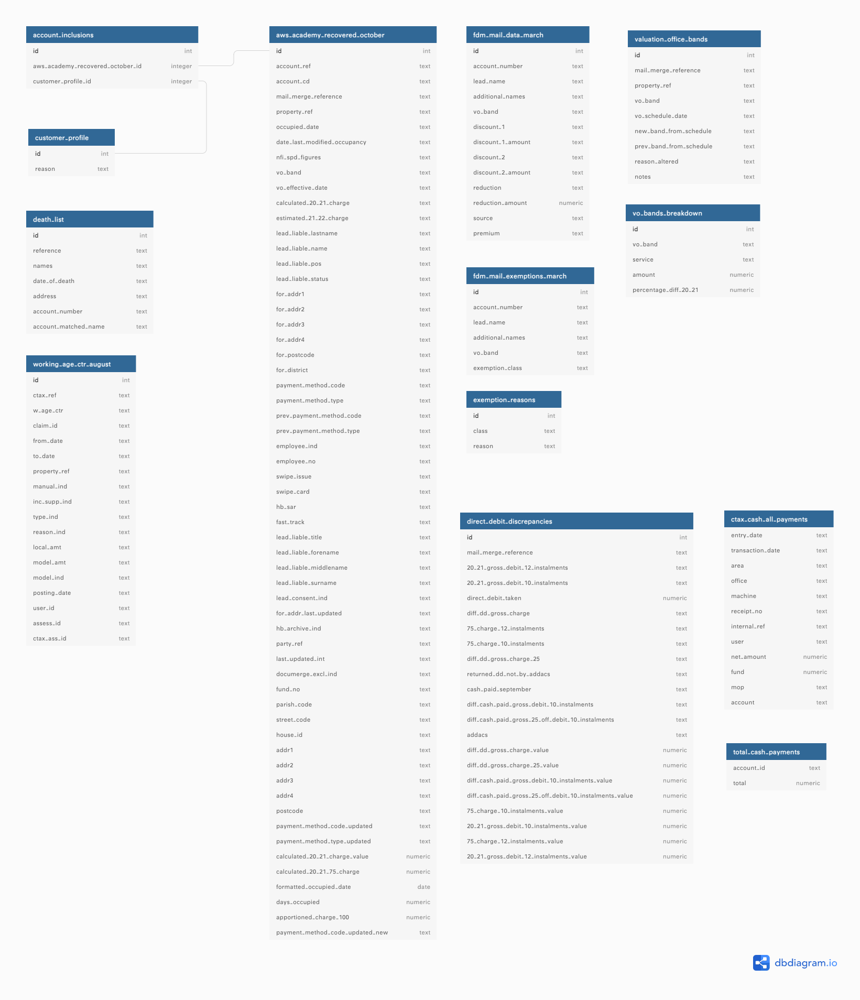

# Database

## High-level diagram of data sources

## Low-level diagram of data sources

This diagram was created using <https://dbdiagram.io/>

## Data Sources

| Name | Description |
|:-------------|:-------------:|
| **AWS Academy Recovery** | Retrieved back up from Academy. It contains all the information in Academy as of October 2020. |
| **FDM Bill Print Files** | Data extracted from text files that Academy would generate when it's time print bills. These files are sent to the printer, i.e. FDM. |
| **FDM Exemption Print Files** | Data on which accounts have tax exemptions and the reason. This is split up into two tables in the database. One for accounts with exemptions, other for the exemption reason. |
| **Working Age** | Data on working-age council tax reductions. |
| **Valuation Office Bands** | Split into two tables in the database. One describes properties and their associated VO Bands. The other table details the cost of council services, i.e. Adult Social Care, London Borough of Hackney & Greater London Authority, per VO band. |
| **Direct Debit Discrepancies** | Data on accounts, liability charge, instalments and any information from [addacs](https://www.bacs.co.uk/Services/bacsschemes/directdebit/services/pages/addacs.aspx). |
| **Cash Payments** | Data on accounts, net cash payment per month (from April to December) and other cash payment-related information. |
| **Recently Deceased** | Data on account holders who had passed away between December 2020 - January 2021. |
